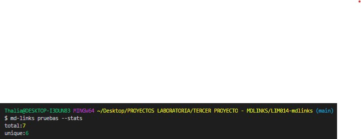

Markdown Links
Índice
1. Preámbulo
2. Resumen del proyecto
3. Diagrama de Flujo
1. Preámbulo
Markdown es un lenguaje de marcado ligero muy popular entre developers. Es usado en muchísimas plataformas que manejan texto plano (GitHub, foros, blogs, ...), y es muy común encontrar varios archivos en ese formato en cualquier tipo de repositorio (empezando por el tradicional README.md).

Estos archivos Markdown normalmente contienen links (vínculos/ligas) que muchas veces están rotos o ya no son válidos y eso perjudica mucho el valor de la información que se quiere compartir.

Dentro de una comunidad de código abierto, nos han propuesto crear una herramienta usando Node.js, que lea y analice archivos en formato Markdown, para verificar los links que contengan y reportar algunas estadísticas.

md-links

2. Resumen del proyecto
Este proyecto presenta una API librería, la cual le permiten al usuario, realizar la validación de links y verificar su estado a través de los comandos --validate y --stats. No obstante a ello, de no colocar correctamente los comandos antes mencionados, el terminal le indicará al usuario que ingrese los comandos antes correctos (--validate y --stats).

Por otro lado, para usar los comandos --validate y --stats, se debe de colocar antes md-links más el nombre de la carpeta en donde se encuentran los links que se van a verificar, para este proyecto el nombre de esta carpeta donde se encuentran los links que se van a verificar es "pruebas", es decir; que para llamar correctamente a los comandos se realiza de la siguiente manera: 

- md-links pruebas --validate 
- md-links pruebas --stats
- md-links pruebas --stats --validate // md-links pruebas --validate --stats

A continuación se muestran los resultados que brinda la consola para cada comando.

## Comando --validate

## Comando --stats

## Comando --stats --validate

## Comando incorrecto

3. Diagrama de Flujo

A continuación se muestran los diagramas de frujo que se crearon inicialmente para la realización de este proyecto, correspondientes al API y CLI.

## Diagrama de flujo API

## Diagrama de flujo CLI

