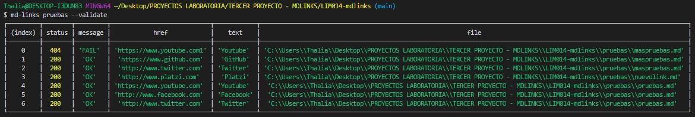
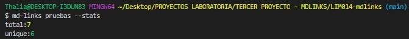
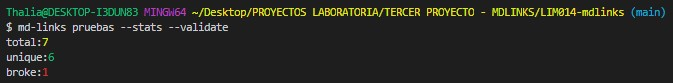
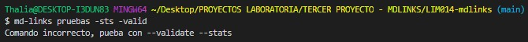
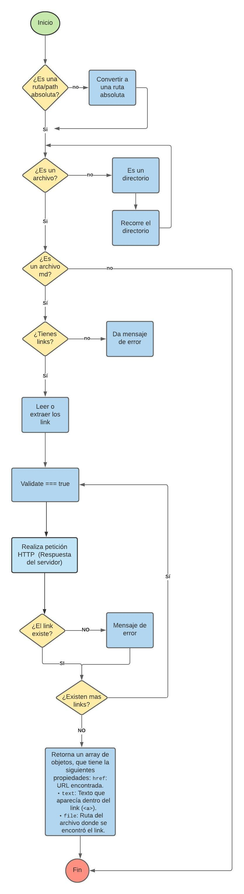
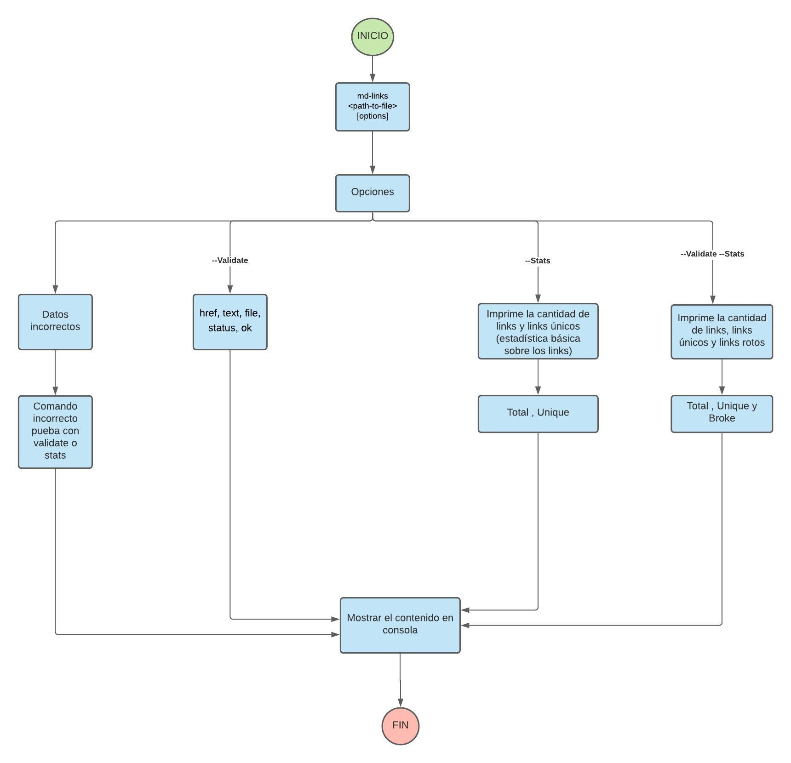

Markdown Links
Índice

Markdown es un lenguaje de marcado ligero muy popular entre developers. Es usado en muchísimas plataformas que manejan texto plano (GitHub, foros, blogs, ...), y es muy común encontrar varios archivos en ese formato en cualquier tipo de repositorio (empezando por el tradicional README.md).

Estos archivos Markdown normalmente contienen links (vínculos/ligas) que muchas veces están rotos o ya no son válidos y eso perjudica mucho el valor de la información que se quiere compartir.

Dentro de una comunidad de código abierto, nos han propuesto crear una herramienta usando Node.js, que lea y analice archivos en formato Markdown, para verificar los links que contengan y reportar algunas estadísticas.

md-links

Resumen del proyecto
Este proyecto presenta una API librería, la cual le permiten al usuario, realizar la validación de links y verificar su estado a través de los comandos --validate y --stats. No obstante a ello, de no colocar correctamente los comandos antes mencionados, el terminal le indicará al usuario que ingrese los comandos antes correctos (--validate y --stats).

Por otro lado, para usar los comandos --validate y --stats, se debe de colocar antes md-links más el nombre de la carpeta en donde se encuentran los links que se van a verificar, para este proyecto el nombre de esta carpeta donde se encuentran los links que se van a verificar es "pruebas", es decir; que para llamar correctamente a los comandos se realiza de la siguiente manera: 

- md-links pruebas --validate 
- md-links pruebas --stats
- md-links pruebas --stats --validate // md-links pruebas --validate --stats

## Instalación
Para la instalación de esta librería se realiza lo siguiente:

npm install https://github.com/Thalia001/LIM014-mdlinks

## API mdLinks(path, opts)
El módulo exporta una función con la interfaz (API) esperada.
El módulo implementa :
soporte para archivo individual.
soporte para directorios.
options.validate
## CLI
Expone ejecutable md-links en el path (configurado en package.json)
Se ejecuta sin errores / output esperado
El ejecutable implementa:
--validate
--stats
--validate y --stats (juntos)
## JavaScript API
El módulo debe poder importarse en otros scripts de Node.js y debe ofrecer la siguiente interfaz:

mdLinks(path, options)
Argumentos
- path: Ruta absoluta o relativa al archivo o directorio. Si la ruta pasada es relativa, debe resolverse como relativa al directorio desde donde se invoca node - current working directory).
- options: Un objeto con únicamente la siguiente propiedad:
- validate: Booleano que determina si se desea validar los links encontrados.
- Valor de retorno
La función debe retornar una promesa (Promise) que resuelva a un arreglo (Array) de objetos (Object), donde cada objeto representa un link y contiene las siguientes propiedades:

- href: URL encontrada.
- text: Texto que aparecía dentro del link (<a>).
- file: Ruta del archivo donde se encontró el link.

A continuación se muestran los resultados que brinda la consola para cada comando.

## Comando --validate

## Comando --stats

## Comando --stats --validate

## Comando incorrecto

3. Diagrama de Flujo

A continuación se muestran los diagramas de frujo que se crearon inicialmente para la realización de este proyecto, correspondientes al API y CLI.

## Diagrama de flujo API

## Diagrama de flujo CLI

